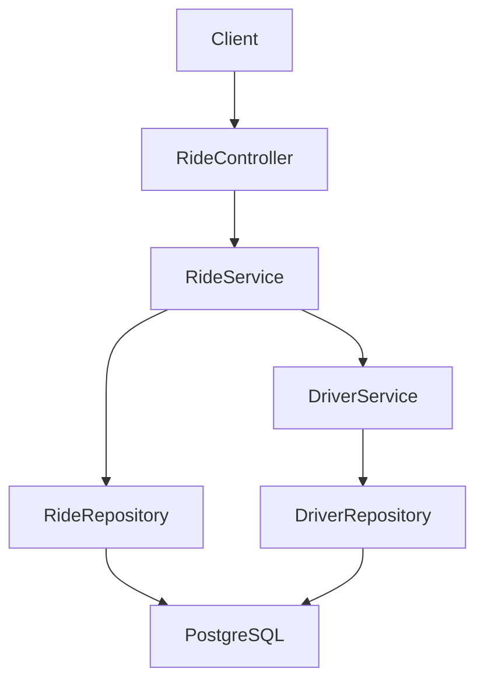

---

# Uber Backend Clone – Spring Boot

A backend system that simulates the core functionality of a ride-hailing platform similar to Uber.

This project focuses on **backend system design and REST API development** using Spring Boot. It demonstrates ride lifecycle management, driver availability handling, and database persistence for a ride booking system.

---

# Features

* Rider ride request workflow
* Driver availability management
* Trip lifecycle management
* Driver–rider matching logic
* RESTful API design
* PostgreSQL persistence layer
* Layered backend architecture

---

# Tech Stack

### Backend

* Java
* Spring Boot
* Spring Data JPA
* REST APIs

### Database

* PostgreSQL

### Build Tool

* Maven

---

# System Architecture

The application follows a **layered architecture pattern**.

```
Client
  |
Controller Layer
  |
Service Layer
  |
Repository Layer
  |
PostgreSQL Database
```

### Layer Responsibilities

**Controller Layer**

* Handles incoming HTTP requests
* Validates request payload
* Delegates logic to service layer

**Service Layer**

* Contains core business logic
* Handles ride lifecycle management
* Manages driver matching logic

**Repository Layer**

* Handles database operations
* Uses Spring Data JPA for persistence

---

# Architecture Diagram

GitHub automatically renders the diagram below.



---

# Ride Lifecycle

Typical ride workflow:

```
Rider requests ride
        |
Find available driver
        |
Driver accepts ride
        |
Trip starts
        |
Trip ends
```

Example ride states:

```
REQUESTED
ACCEPTED
STARTED
COMPLETED
CANCELLED
```

---

# Example APIs

### Request Ride

```
POST /rides/request
```

Example request body

```json
{
  "riderId": 10,
  "pickupLocation": "Location A",
  "destination": "Location B"
}
```

---

### Update Driver Availability

```
POST /drivers/availability
```

Updates driver availability status.

---

### Get Ride Details

```
GET /rides/{rideId}
```

Returns ride details including trip status.

---

# Database Design

Core entities used in the system:

```
Driver
Rider
Ride
Location
```

Relationships:

```
Rider → Ride
Driver → Ride
Ride → Location
```

PostgreSQL is used as the persistence layer.

---

# How to Run

Clone the repository

```
git clone https://github.com/lokesh2yss/Spring-Boot-Uber-App
```

Navigate to the project directory

```
cd Spring-Boot-Uber-App
```

Run the application

```
mvn spring-boot:run
```

Ensure PostgreSQL is running and configured in `application.properties`.

---

# Possible Future Improvements

* Add Redis caching for faster driver lookup
* Introduce Kafka for event-driven architecture
* Implement real-time driver location updates
* Add rate limiting for ride requests
* Containerize services using Docker
* Introduce microservices architecture

---

# Purpose of the Project

This project was created to explore backend system design concepts including:

* REST API design
* scalable backend architecture
* ride lifecycle modeling
* database schema design
* production-style backend service structure

---

# Author

Lokesh Kumar

Senior Backend Engineer
Java | Spring Boot | Distributed Systems

LeetCode Profile
[https://leetcode.com/u/lokeshtalks/](https://leetcode.com/u/lokeshtalks/)

---

