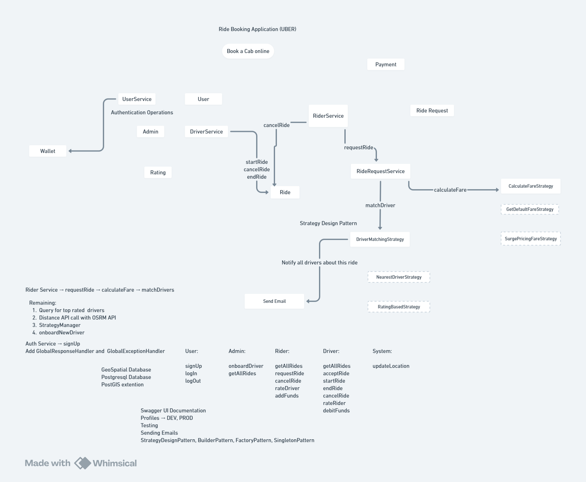

---

# Uber Backend System – Spring Boot

Java | Spring Boot | PostgreSQL | PostGIS | JWT | System Design

A backend system that simulates the core functionality of a ride-hailing platform similar to **Uber**.

---

# System Design Summary

This project demonstrates the backend architecture of a ride-hailing platform similar to Uber.

Key architectural characteristics:

* Backend services implemented using **Spring Boot**
* **Strategy pattern** used for driver matching and fare calculation
* **PostgreSQL + PostGIS** used for geospatial driver search
* **JWT-based authentication and authorization**
* Modular domain services for riders, drivers, rides, and payments

The system models the complete ride lifecycle including ride requests, driver matching, trip execution, and payment handling.

---

# Application Overview

The system enables riders to request rides and drivers to accept and complete trips.

Core capabilities include:

* rider ride requests
* driver matching
* ride lifecycle management
* fare calculation
* wallet and payment handling
* driver and rider ratings
* JWT-based authentication and authorization

The backend is organized into domain services responsible for riders, drivers, rides, and user authentication.

---

# Features

### Rider

* request ride
* cancel ride
* rate driver
* view ride history
* add funds to wallet

### Driver

* accept ride
* start ride
* end ride
* cancel ride
* rate rider
* view ride history

### Admin

* onboard drivers
* view system rides

### System

* driver matching
* fare calculation
* ride lifecycle management
* location updates

---

# Tech Stack

### Backend

* Java
* Spring Boot
* Spring Data JPA
* Spring Security
* REST APIs

### Authentication

* JWT Token Authentication
* Role-based Authorization

### Database

* PostgreSQL
* PostGIS extension (for geospatial queries)

### Tools

* Maven
* Swagger UI

---

# System Architecture

The backend follows a **layered architecture**:

```
Controller Layer
        ↓
Service Layer
        ↓
Repository Layer
        ↓
PostgreSQL + PostGIS
```

Major domain services:

* **UserService** – authentication and user management
* **RiderService** – rider operations
* **DriverService** – driver operations
* **RideRequestService** – ride request handling
* **Ride** – ride lifecycle management
* **Wallet** – payment handling
* **Rating** – driver/rider ratings

---

# Architecture Diagram

The following diagram illustrates the service interactions during the ride booking workflow.



---

# Ride Booking Workflow

### Step 1 — Rider requests ride

```
POST /requestRide
```

Request contains:

* riderId
* pickup location
* destination location

The request is received by **RiderService** and forwarded to **RideRequestService**.

---

### Step 2 — Fare calculation

The fare is calculated using the **Strategy Pattern**.

Available strategies:

* DefaultFareStrategy
* SurgePricingFareStrategy

```
RideRequestService
      ↓
calculateFare()
      ↓
CalculateFareStrategy
```

---

### Step 3 — Driver matching

The system selects the most suitable driver using **DriverMatchingStrategy**.

Matching may consider:

* driver proximity
* driver rating
* driver availability

Distance calculations may use:

* PostGIS geospatial queries
* OSRM distance API

Possible strategies:

* NearestDriverStrategy
* RatingBasedStrategy

---

### Step 4 — Driver accepts ride

Once drivers are notified, a driver can accept the ride.

```
POST /acceptRide
```

DriverService processes the request and updates ride status.

---

# Ride Lifecycle

The ride progresses through the following states:

```
REQUESTED
ACCEPTED
STARTED
COMPLETED
CANCELLED
```

Driver APIs controlling the lifecycle:

```
POST /startRide
POST /endRide
POST /cancelRide
```

---

# Authentication & Authorization

The system uses **JWT-based authentication**.

User authentication endpoints:

```
POST /signup
POST /login
```

After login:

* server issues **JWT token**
* token must be included in request headers

Example:

```
Authorization: Bearer <JWT_TOKEN>
```

Role-based access control ensures:

* riders access rider APIs
* drivers access driver APIs
* admins access admin APIs

---

# Core Entities

Main domain entities:

```
User
Rider
Driver
Ride
Wallet
Rating
```

Relationships:

```
Rider → Ride
Driver → Ride
Ride → Location
```

PostGIS enables geospatial operations such as **nearest driver search**.

---

# Design Patterns Used

The system uses several object-oriented design patterns:

* Strategy Pattern
* Builder Pattern
* Factory Pattern
* Singleton Pattern

Strategy Pattern is used for:

* driver matching
* fare calculation

---

# Additional Components

Other infrastructure features include:

* Swagger API documentation
* GlobalExceptionHandler
* GlobalResponseHandler
* DEV and PROD profiles
* email notifications

---

# Running the Project

Clone the repository

```
git clone https://github.com/lokesh2yss/Spring-Boot-Uber-App
```

Navigate to the project directory

```
cd Spring-Boot-Uber-App
```

Run the application

```
mvn spring-boot:run
```

Ensure PostgreSQL is running and configured in `application.properties`.

---

# Future Improvements

Possible enhancements:

* Redis caching for driver lookup
* Kafka event-driven architecture
* real-time driver location tracking
* distributed ride matching
* microservice architecture
* Docker deployment

---

# Author

Lokesh Kumar
Senior Backend Engineer
Java | Spring Boot | Distributed Systems

LeetCode
[https://leetcode.com/u/lokeshtalks/](https://leetcode.com/u/lokeshtalks/)

---
